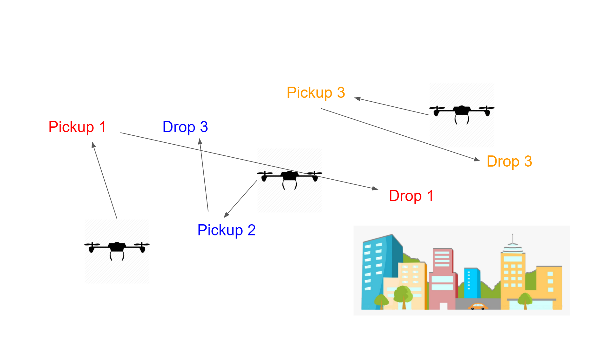
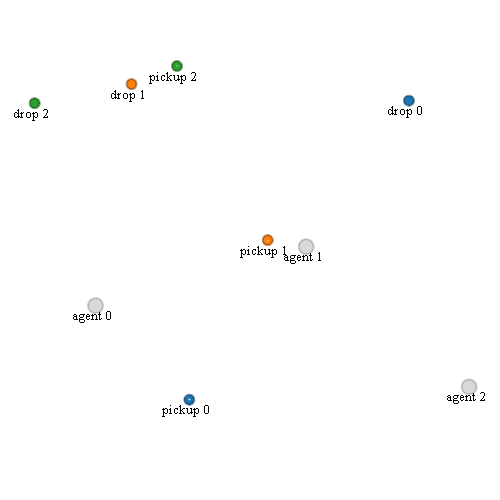

# Multi UAV Payload using Multi-Agent-Reinforcement-Learning
## Based on Multiagent Particle Environments and MADDPG
Code for MTP

## Requirements
* Python 3.6.1 (Minimum)
* [OpenAI baselines](https://github.com/openai/baselines), commit hash: 98257ef8c9bd23a24a330731ae54ed086d9ce4a7
* My [fork](https://github.com/shariqiqbal2810/multiagent-particle-envs) of Multi-agent Particle Environments
* [PyTorch](http://pytorch.org/), version: 0.3.0.post4
* [OpenAI Gym](https://github.com/openai/gym), version: 0.9.4
* [Tensorboard](https://github.com/tensorflow/tensorboard), version: 0.4.0rc3 and [Tensorboard-Pytorch](https://github.com/lanpa/tensorboard-pytorch), version: 1.0 (for logging)

# Project Overview
UAV has to go to the pickup location to carry the load and drop it to the drop location.  

# Current Working Solution

